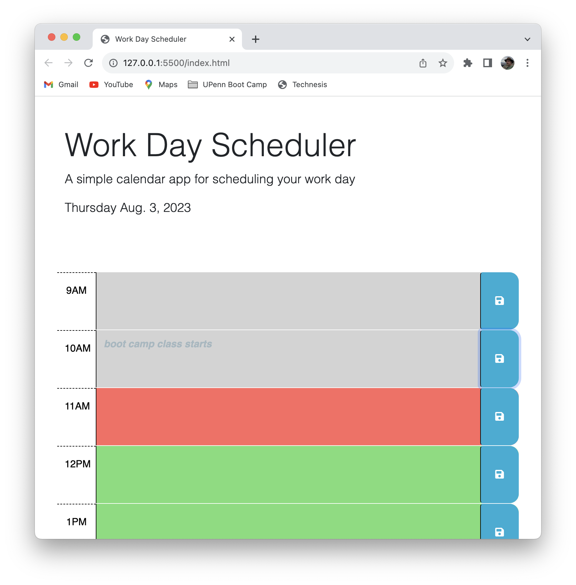
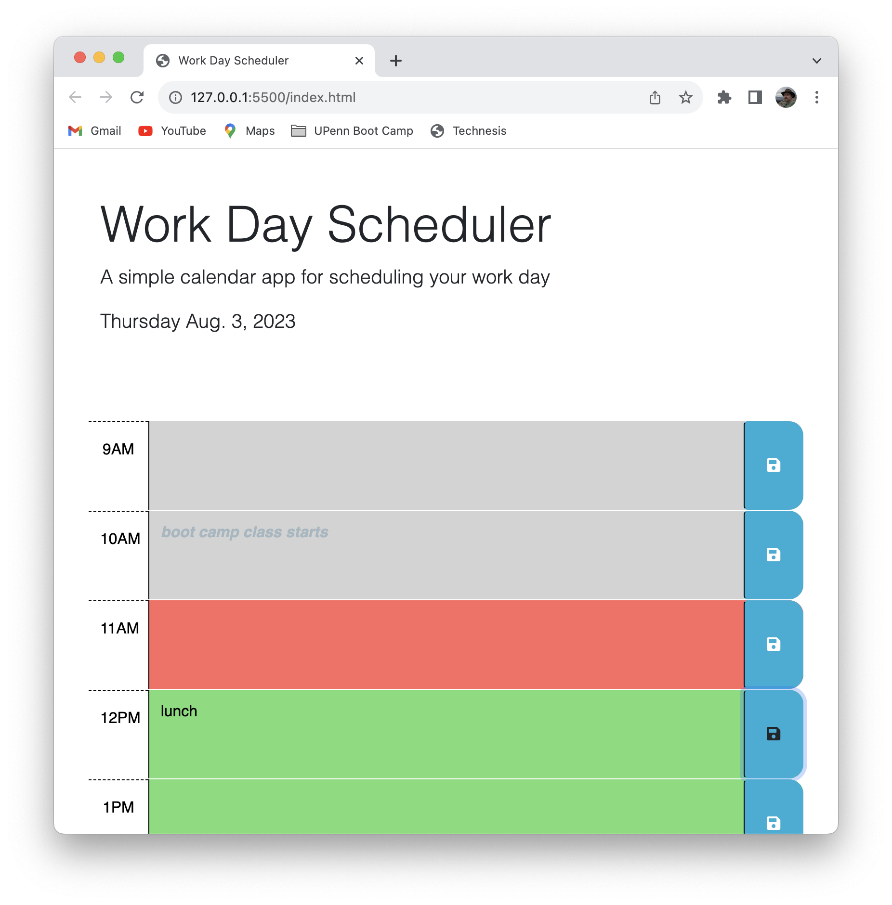

# Work Day Scheduler

## Description

A project whose goal is to create a javascript-driven calendar / task tracker for a
single work day.

- Key features of the resulting HTML/CSS/Javascript site are:
    - Displayed hours are color-coded as past/present/future.
    - Previously stored calendar entries are retrieved and displayed in their respective
        hourly rows.
    - Unsaved notations in hourly rows are highlighted to remind users that these changes
        are not yet saved.
    - Entries can be saved by clicking on the blue buttons associated with each hour.  Doing so
        also clears the 'unsaved' highlighting noted above.

- In completing this project, the following have been learned:
    - use of event bubbling / delegation to enable simplified use of listeners on multiple elements
    - dynamic creation and alteration of HTML elements
    - persistence via use of localStorage
    - navigation between elements using attributes and id's
    - enhanced presentation using third-party formatting (Bootstrap)
    - date/time manipulation using DayJS

## Table of Contents

- [Usage](#usage)
- [Credits](#credits)
- [License](#license)

## Installation

For users of the this page, there is no installation needed beyond having a browser.  (see [Usage](#usage))

For developers, installation requires:
- Access to GitHub repository [github.com/stevreut/work-day-scheduler](https://github.com/stevreut/work-day-scheduler) 
- Appropriate tools for editing, testing, and deploying component modules.

## Usage

The result of this project is a web site accessible via web browser at [stevreut.github.io/work-day-scheduler/](https://stevreut.github.io/work-day-scheduler/) .  No installation is required beyond that for use.

Resulting web presentation should resemble the following:

## Credits

Special thanks to the teaching staff of the University of Pennsylvania Full Stack Coding Boot Camp (UPENN-VIRT-FSF-FT-07-2023-U-LOLC-M-F).

Innumerable publicly available reference resources were consulted in pursuing this project.

## License

As of this date (3 August 2023), no licensing policy has been established for this project or its repository.
